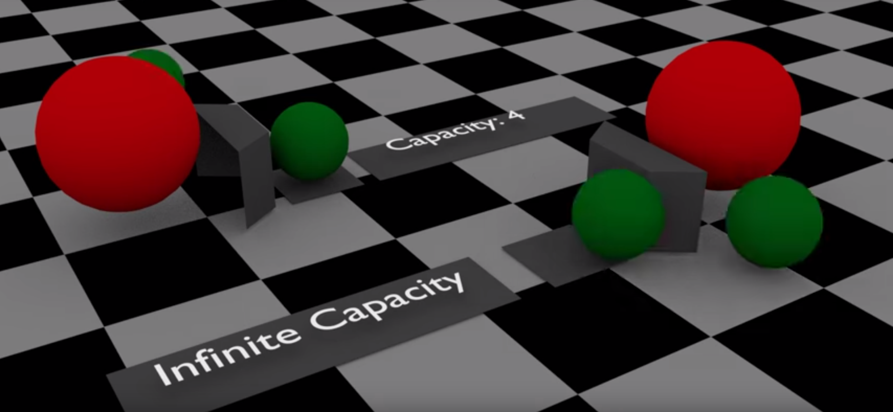
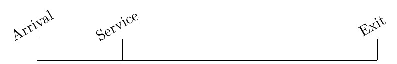
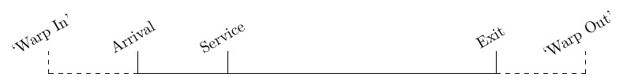
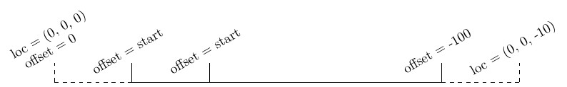
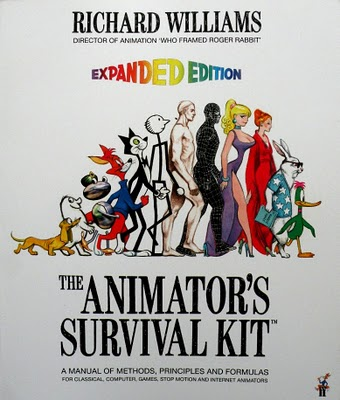

:title: Queues, Queueing and Ciw: Superpowers for Animators!
:css: talk.css
:data-transition-duration: 0

----

:id: title

Queues, Queueing and Ciw: Superpowers for Animators!
====================================================

- Twitter: `@alcarneyorg <https://twitter.com/alcarneyorg>`_
- Blog: http://alcarney.org
- Slides: http://superpowers.alcarney.org

----

:id: animation

What is Animation?
==================

.. image :: animation.jpg

.

    Animation is creating the illusion of motion, using a rapid
    succession of still images.

.. note::

    - Give examples of animation:
        + Flipbooks
        + Stop Motion - Wallace and Gromit
        + 3D Animation - Shrek, Toy Story
        + Traditional Animation - Snow White, Lion King.

----

:id: tradition

Traditional Animation
=====================

- Snow White, Cinderella, Lion King etc.

- Lead animator would draw 'keyframes' depicting important poses

.. image :: keyframes.jpg

- Junior animators would draw 'inbetweeners' creating the motion
  between the keyframes

----

:id: blender

What is Blender?
================

.. image:: blender.png
    :height: 400px
    :width: 400px

----

I'll show you!
==============

.. note::

    - Introduce Blender, model a car quickly.
    - Show how to animate character - draw parallels to traditional animation
    - Now bring up animating a character - time consuming.
    - How are we going to get around this - for BACKGROUND animation?
    - Queues!!

----

:id: queue

What is a Queue?
================

.. note::

    - Explain what a queue is
    - Where do we find them
    - How it will help us with our animation
    - If only there was a way to simulate these queues....

----

:id: ciw

Cue Ciw!
========

.. image:: ciw.png
   :height: 400px
   :width: 400px

.. note::

    - Demo Ciw in Jupyter Notebook
    - Show the Getting Started with Ciw example from the documentation
    - Switch to Blender and show how we would animate a single car by hand.
    - Then introduce the API.

----

Duplicating an Object
=====================

.. code:: python

    # How many actors do we have?
    num_actors = len(bpy.data.groups['Actors'].objects)

    # Pick a random object to duplicate
    obj = bpy.data.groups['Actors'].objects[randint(0, num_actors - 1)]

    # Instance it
    mesh = obj.data
    actor = bpy.data.objects.new(obj.name, mesh)
    actor.location = (0, 0, -10)

    # Link it to the scene
    bpy.context.scene.objects.link(actor)

    return actor

----

:id: constraint
:data-x: r1800

The Follow Path Constraint
==========================

.. image :: constraint.png
    :height: 400px
    :width: 350px

.. code:: python

    constraint = actor.constraints.new(type='FOLLOW_PATH')
    constraint.target = bpy.data.objects['Path' + str(record['Class'])]
    constraint.use_curve_follow = True
    constraint.forward_axis = 'FORWARD_Y'

----

Offset Keyframes
================

.. code:: python

  def insert_offset_keyframe(obj, time, offset):

      # Set the new offset
      obj.constraints['Follow Path'].offset = offset

      # Record the keyframe
      obj.keyframe_insert(
           data_path='constraints["Follow Path"].offset', frame=time)

----

Location Keyframes
==================

.. code:: python

  def insert_loc_keyframe(obj, time, loc):

      # Set the object's location
      obj.location = loc

      # Record the keyframe
      obj.keyframe_insert(data_path='location', frame=time)

----

Attempt 1
=========

----

Attempt 1
=========

----

Attempt 1
=========

----

Want to know more about....?
============================

----

:id: more-animation

....Animation?
==============

- Animator's Survival Kit:

----

....Blender?
============

----

Future Work
===========

- Integrate Ciw into Blender
- Make networks composeable
- More complex animations
- Extract common code into some sort of library

----

Questions?
==========
